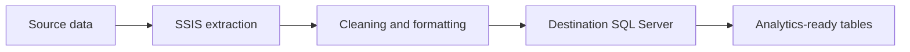

# Sales ETL Pipeline with SQL Server Integration Services

A portfolio project that demonstrates an **Extract, Transform, Load (ETL)** workflow built with SQL Server Integration Services (SSIS). The solution contains SSIS packages, a Visual Studio solution, project parameters, and data-flow/control-flow diagrams.

## Objective

The project models a typical batch-integration workflow: extract records from a source, apply cleaning and formatting transformations, and load the resulting data into a destination SQL Server database for downstream reporting or analysis.

## Architecture



## Technology Stack

- SQL Server
- SQL Server Integration Services (SSIS)
- Visual Studio with the SSIS extension
- `.dtsx` packages and project parameters

## Repository Structure

```text
ETL/
├── ETL.sln
├── ETL/
│   ├── ETL.dtproj
│   ├── Project.params
│   ├── DimCus.dtsx
│   ├── Fact.dtsx
│   ├── Saleman.dtsx
│   └── SSISpRroject.dtsx
├── images/
│   ├── control flow.png
│   ├── Data flow.png
│   └── Data flow Sales.png
└── README.md
```

## Workflow

The packages are organized around source extraction, transformation, and loading steps. The included diagrams document the control flow and data-flow design. The exact source and destination connection managers must be configured for the local SQL Server environment before execution.

## Run the Project

1. Install SQL Server and Visual Studio with the SQL Server Integration Services Projects extension.
2. Clone the repository:

   ```bash
   git clone https://github.com/Fatoomnoour/ETL.git
   cd ETL
   ```

3. Open `ETL.sln` in Visual Studio.
4. Review and update the project parameters and connection managers.
5. Confirm that the destination database and required tables are available.
6. Execute the required `.dtsx` package from Visual Studio or deploy it to an SSIS catalog.
7. Validate row counts, rejected records, and destination-table results after execution.

## Data Quality and Validation

Before describing this project as production-ready, document the source schema, target schema, expected row counts, error-output handling, and rerun behavior. A robust extension should include package logging, data-quality checks, failure notifications, and an idempotent loading strategy.

## Limitations

The repository provides the SSIS solution and diagrams but does not currently document a public sample database, connection configuration, automated validation results, or a deployed SSIS catalog. It should therefore be presented as a reproducible design/demo project rather than a verified production deployment.

## Author

**Fatma Nour** — [GitHub](https://github.com/Fatoomnoour)
